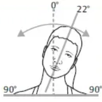

# ROM 비디오 분석 요청

### ROM 비디오 분석 요청

<mark style="color:green;">`POST`</mark> `http://115.94.164.253:15003/ROM/analysis-await`

비디오를 입력 받아 사용자의 ROM을 분석합니다.

**파라미터(json)**

<table><thead><tr><th>Name</th><th>Type</th><th>Description</th><th data-type="checkbox">Required</th></tr></thead><tbody><tr><td><code>id</code></td><td>string</td><td>유저 이메일 주소</td><td>true</td></tr><tr><td><code>bucketUrl</code></td><td>string</td><td>영상 s3 주소.</td><td>true</td></tr><tr><td><code>motionDetail</code></td><td>string</td><td>영상 종류. 하단 설명 참고.</td><td>true</td></tr><tr><td><code>uuid</code></td><td>string</td><td>분석 비디오 uuid</td><td>true</td></tr><tr><td><code>credit</code></td><td>int</td><td>로직 상 필요한 더미 데이터. 정수 1000을 보내면 됨.</td><td>true</td></tr><tr><td><code>rqUrl</code></td><td>string</td><td>완료 시 결과를 돌려 받을 url.</td><td>false</td></tr></tbody></table>

**motionDetail 상세 설명**

neckLateralFlexion: 목 좌우 굽히기



neckRotation: 목 돌리기

.png>)

neckFlexion: 목 굽히기-펴기

.png>)

leftArmLateralFlexion: 왼팔 밖으로 들기-안으로 당기기

.png>)

\*따로 사진 자료가 없어 여기부터 사진 생략합니다

leftArmFlexion: 왼어깨 앞으로-뒤로 회전하기

leftShoulderRotation: 왼팔 앞으로 올리기-뒤로 올리기

rightArmLateralFlexion: 오른팔 밖으로 들기-안으로 당기기

rightArmFlexion: 오른어깨 앞으로-뒤로 회전하기

rightShoulderRotation: 오른팔 앞으로 올리기-뒤로 올리기

**응답(json)**

<table><thead><tr><th width="164">Name</th><th width="88">Type</th><th>Description</th></tr></thead><tbody><tr><td><code>state</code></td><td>bool</td><td>성공 시 1, 실패 시 0</td></tr><tr><td><code>message</code></td><td>string</td><td>성공 또는 실패 관련 안내 메세지</td></tr><tr><td><code>uuid</code></td><td>string</td><td>영상 uuid</td></tr><tr><td><code>waitTime</code></td><td>int</td><td>응답 후 결과 생성까지 대기 시간</td></tr><tr><td><code>fileExist</code></td><td>bool</td><td>이미 존재하는 파일이면 True, 아니면 False</td></tr><tr><td><code>credit</code></td><td>int</td><td>사용 예정 크레딧 수량</td></tr></tbody></table>

**요청 예시**

```json
{
  "bucketUrl": "https://fourwk-public.s3.ap-northeast-2.amazonaws.com/motion-analysis-samples/running3.mp4",
  "id": "example@example.com",
  "uuid": "c37d3ce2-e9d0-45de-9656-2a730204f8ca",
  "motionDetail": "neckLateralFlexion",
  "rqUrl": "http://115.94.164.254:6100/webhook",
  "credit": 1000
}
```

**예시 코드**



```python
import requests
import uuid

task_uuid = str(uuid.uuid4())
rq_dict = {'bucket_url':"https://fourwk-public.s3.ap-northeast-2.amazonaws.com/motion-analysis-samples/running3.mp4",'id':"example@example.com",'uuid':video_uuid,'height':"160","credit":1000}

res = requests.post("http://115.94.164.253:15003/running/analysis-await", json=rq_dict)
```



**응답 예시**



```json
{
  'state': True,
  'waitTime': 13,
  'fileExist': False,
  'uuid': 'f3d19b30-4157-43a6-9ac6-255852ee2997',
  'message': 'success',
  'credit': 4
}
```



**webhook 응답(json)**

**\***&#xC608;시 스키마(motionDetail = neckLateralFlexion)

<table><thead><tr><th width="164">Name</th><th width="88">Type</th><th>Description</th></tr></thead><tbody><tr><td><code>state</code></td><td>int</td><td>성공 시 True, 실패 시 False.</td></tr><tr><td><code>message</code></td><td>string</td><td>성공 또는 실패 관련 안내 메세지.</td></tr><tr><td><code>uuid</code></td><td>string</td><td>영상 uuid.</td></tr><tr><td><code>motionDetail</code></td><td>string</td><td>파라미터로 전달 받았던 영상 종류.</td></tr><tr><td><code>neckLeftLateralFlexionAngle</code></td><td>float</td><td>왼쪽으로 목을 굽혔을 때 최대 각도.</td></tr><tr><td><code>neckRightLateralFlexionAngle</code></td><td>float</td><td>오른쪽으로 목을 굽혔을 때 최대 각도.</td></tr><tr><td><code>neckLeftLateralFlexionIndex</code></td><td>int</td><td>왼쪽으로 목을 굽혔을 때 최대 각도 시점의 인덱스.</td></tr><tr><td><code>neckRightLateralFlexionIndex</code></td><td>int</td><td>오른쪽으로 목을 굽혔을 때 최대 각도 시점의 인덱스.</td></tr><tr><td><code>neckLeftLateralFlexionImage</code></td><td>string</td><td>왼쪽으로 목을 굽혔을 때 최대 각도 시점의 이미지. base64 인코딩 됨.</td></tr><tr><td><code>neckRightLateralFlexionImage</code></td><td>string</td><td>오른쪽으로 목을 굽혔을 때 최대 각도 시점의 이미지. base64 인코딩 됨.</td></tr></tbody></table>

\*항상 응답

<table><thead><tr><th width="164">Name</th><th width="88">Type</th><th>Description</th></tr></thead><tbody><tr><td><code>state</code></td><td>int</td><td>성공 시 True, 실패 시 False.</td></tr><tr><td><code>message</code></td><td>string</td><td>성공 또는 실패 관련 안내 메세지.</td></tr><tr><td><code>uuid</code></td><td>string</td><td>영상 uuid.</td></tr><tr><td><code>motionDetail</code></td><td>string</td><td>파라미터로 전달 받았던 영상 종류.</td></tr></tbody></table>

**\***&#x6D;otionDetail 값에 따른 응답

1. motionDetail = neckLateralFlexion

<table><thead><tr><th width="164">Name</th><th width="88">Type</th><th>Description</th></tr></thead><tbody><tr><td>neckLeftLateralFlexionAngle</td><td>float</td><td>왼쪽으로 목을 굽혔을 때 최대 각도.</td></tr><tr><td>neckRightLateralFlexionAngle</td><td>float</td><td>오른쪽으로 목을 굽혔을 때 최대 각도.</td></tr><tr><td>neckLeftLateralFlexionIndex</td><td>int</td><td>왼쪽으로 목을 굽혔을 때 최대 각도 시점의 인덱스.</td></tr><tr><td>neckRightLateralFlexionIndex</td><td>int</td><td>오른쪽으로 목을 굽혔을 때 최대 각도 시점의 인덱스.</td></tr><tr><td>neckLeftLateralFlexionImage</td><td>string</td><td>왼쪽으로 목을 굽혔을 때 최대 각도 시점의 이미지. base64 인코딩 됨.</td></tr><tr><td>neckRightLateralFlexionImage</td><td>string</td><td>오른쪽으로 목을 굽혔을 때 최대 각도 시점의 이미지. base64 인코딩 됨.</td></tr></tbody></table>

2. motionDetail = neckRotation

<table><thead><tr><th width="164">Name</th><th width="88">Type</th><th>Description</th></tr></thead><tbody><tr><td>neckLeftRotationAngle</td><td>float</td><td>왼쪽으로 목을 돌렸을 때 최대 각도.</td></tr><tr><td>neckRightRotationAngle</td><td>float</td><td>오른쪽으로 목을 돌렸을 때 최대 각도.</td></tr><tr><td>neckLeftRotationIndex</td><td>int</td><td>왼쪽으로 목을 돌렸을 때 최대 각도 시점의 인덱스.</td></tr><tr><td>neckRightRotationIndex</td><td>int</td><td>오른쪽으로 목을 돌렸을 때 최대 각도 시점의 인덱스.</td></tr><tr><td>neckLeftRotationImage</td><td>string</td><td>왼쪽으로 목을 돌렸을 때 최대 각도 시점의 이미지. base64 인코딩 됨.</td></tr><tr><td>neckRightRotationImage</td><td>string</td><td>오른쪽으로 목을 돌렸을 때 최대 각도 시점의 이미지. base64 인코딩 됨.</td></tr></tbody></table>

3. motionDetail = neckFlexion

<table><thead><tr><th width="164">Name</th><th width="88">Type</th><th>Description</th></tr></thead><tbody><tr><td>neckFlexionAngle</td><td>float</td><td>목을 폈을 때 최대 각도.</td></tr><tr><td>neckExtensionAngle</td><td>float</td><td>목을 접었을 때 최대 각도.</td></tr><tr><td>neckFlexionIndex</td><td>int</td><td>목을 폈을 때 최대 각도 시점의 인덱스.</td></tr><tr><td>neckExtensionIndex</td><td>int</td><td>목을 접었을 때 최대 각도 시점의 인덱스.</td></tr><tr><td>neckFlexionImage</td><td>string</td><td>목을 폈을 때 최대 각도 시점의 이미지. base64 인코딩 됨.</td></tr><tr><td>neckExtensionImage</td><td>string</td><td>목을 접었을 때 최대 각도 시점의 이미지. base64 인코딩 됨.</td></tr></tbody></table>

4. motionDetail = leftArmLateralFlexion

<table><thead><tr><th width="164">Name</th><th width="88">Type</th><th>Description</th></tr></thead><tbody><tr><td>leftArmInLateralFlexionAngle</td><td>float</td><td>왼쪽 팔을 안으로 당겼을 때 최대 각도.</td></tr><tr><td>leftArmOutLateralFlexionAngle</td><td>float</td><td>왼쪽 팔을 밖으로 밀었을 때 최대 각도.</td></tr><tr><td>leftArmInLateralFlexionIndex</td><td>int</td><td>왼쪽 팔을 안으로 당겼을 때 최대 각도 시점의 인덱스.</td></tr><tr><td>neleftArmOutLateralFlexionIndex</td><td>int</td><td>왼쪽 팔을 밖으로 밀었을 때 최대 각도 시점의 인덱스.</td></tr><tr><td>leftArmInLateralFlexionImage</td><td>string</td><td>왼쪽 팔을 안으로 당겼을 때 최대 각도 시점의 이미지. base64 인코딩 됨.</td></tr><tr><td>leftArmOutLateralFlexionImage</td><td>string</td><td>왼쪽 팔을 밖으로 밀었을 때 최대 각도 시점의 이미지. base64 인코딩 됨.</td></tr></tbody></table>

5. motionDetail = leftArmFlexion

<table><thead><tr><th width="164">Name</th><th width="88">Type</th><th>Description</th></tr></thead><tbody><tr><td>leftArmFrontFlexionAngle</td><td>float</td><td>왼쪽 팔을 앞으로 올렸을 때 최대 각도.</td></tr><tr><td>leftArmBackFlexionAngle</td><td>float</td><td>왼쪽 팔을 뒤로 올렸을 때 최대 각도.</td></tr><tr><td>leftArmFrontFlexionIndex</td><td>int</td><td>왼쪽 팔을 앞으로 올렸을 때 최대 각도 시점의 인덱스.</td></tr><tr><td>leftArmBackFlexionIndex</td><td>int</td><td>왼쪽 팔을 뒤로 올렸을 때 최대 각도 시점의 인덱스.</td></tr><tr><td>leftArmFrontFlexionImage</td><td>string</td><td>왼쪽 팔을 앞으로 올렸을 때 최대 각도 시점의 이미지. base64 인코딩 됨.</td></tr><tr><td>leftArmBackFlexionImage</td><td>string</td><td>왼쪽 팔을 뒤로 올렸을 때 최대 각도 시점의 이미지. base64 인코딩 됨.</td></tr></tbody></table>

6. motionDetail = leftShoulderRotation

<table><thead><tr><th width="164">Name</th><th width="88">Type</th><th>Description</th></tr></thead><tbody><tr><td>leftShoulderFrontRotationAngle</td><td>float</td><td>왼쪽 팔을 앞으로 돌렸을 때 최대 각도.</td></tr><tr><td>leftShoulderBackRotationAngle</td><td>float</td><td>왼쪽 팔을 뒤로 돌렸을 때 최대 각도.</td></tr><tr><td>leftShoulderFrontRotationIndex</td><td>int</td><td>왼쪽 팔을 앞으로 돌렸을 때 최대 각도 시점의 인덱스.</td></tr><tr><td>leftShoulderBackRotationIndex</td><td>int</td><td>왼쪽 팔을 뒤로 돌렸을 때 최대 각도 시점의 인덱스.</td></tr><tr><td>leftShoulderFrontRotationImage</td><td>string</td><td>왼쪽 팔을 앞으로 돌렸을 때 최대 각도 시점의 이미지. base64 인코딩 됨.</td></tr><tr><td>leftShoulderBackRotationImage</td><td>string</td><td>왼쪽 팔을 뒤로 돌렸을 때 최대 각도 시점의 이미지. base64 인코딩 됨.</td></tr></tbody></table>

7. motionDetail = rightArmLateralFlexion

<table><thead><tr><th width="164">Name</th><th width="88">Type</th><th>Description</th></tr></thead><tbody><tr><td>rightArmInLateralFlexionAngle</td><td>float</td><td>오른쪽 팔을 안으로 당겼을 때 최대 각도.</td></tr><tr><td>rightArmOutLateralFlexionAngle</td><td>float</td><td>오른쪽 팔을 밖으로 밀었을 때 최대 각도.</td></tr><tr><td>rightArmInLateralFlexionIndex</td><td>int</td><td>오른쪽 팔을 안으로 당겼을 때 최대 각도 시점의 인덱스.</td></tr><tr><td>rightArmOutLateralFlexionIndex</td><td>int</td><td>오른쪽 팔을 밖으로 밀었을 때 최대 각도 시점의 인덱스.</td></tr><tr><td>rightArmInLateralFlexionImage</td><td>string</td><td>오른쪽 팔을 안으로 당겼을 때 최대 각도 시점의 이미지. base64 인코딩 됨.</td></tr><tr><td>rightArmOutLateralFlexionImage</td><td>string</td><td>오른쪽 팔을 밖으로 밀었을 때 최대 각도 시점의 이미지. base64 인코딩 됨.</td></tr></tbody></table>

8. motionDetail = rightArmFlexion

<table><thead><tr><th width="164">Name</th><th width="88">Type</th><th>Description</th></tr></thead><tbody><tr><td>rightArmFrontFlexionAngle</td><td>float</td><td>오른쪽 팔을 앞으로 올렸을 때 최대 각도.</td></tr><tr><td>rightArmBackFlexionAngle</td><td>float</td><td>오른쪽 팔을 뒤로 올렸을 때 최대 각도.</td></tr><tr><td>rightArmFrontFlexionIndex</td><td>int</td><td>오른쪽 팔을 앞으로 올렸을 때 최대 각도 시점의 인덱스.</td></tr><tr><td>rightArmBackFlexionIndex</td><td>int</td><td>오른쪽 팔을 뒤로 올렸을 때 최대 각도 시점의 인덱스.</td></tr><tr><td>rightArmFrontFlexionImage</td><td>string</td><td>오른쪽 팔을 앞으로 올렸을 때 최대 각도 시점의 이미지. base64 인코딩 됨.</td></tr><tr><td>rightArmBackFlexionImage</td><td>string</td><td>오른쪽 팔을 뒤로 올렸을 때 최대 각도 시점의 이미지. base64 인코딩 됨.</td></tr></tbody></table>

9. motionDetail = rightShoulderRotation

<table><thead><tr><th width="164">Name</th><th width="88">Type</th><th>Description</th></tr></thead><tbody><tr><td>rightShoulderFrontRotationAngle</td><td>float</td><td>오른쪽 팔을 앞으로 돌렸을 때 최대 각도.</td></tr><tr><td>rightShoulderBackRotationAngle</td><td>float</td><td>오른쪽 팔을 뒤로 돌렸을 때 최대 각도.</td></tr><tr><td>rightShoulderFrontRotationIndex</td><td>int</td><td>오른쪽 팔을 앞으로 돌렸을 때 최대 각도 시점의 인덱스.</td></tr><tr><td>rightShoulderBackRotationIndex</td><td>int</td><td>오른쪽 팔을 뒤로 돌렸을 때 최대 각도 시점의 인덱스.</td></tr><tr><td>rightShoulderFrontRotationImage</td><td>string</td><td>오른쪽 팔을 앞으로 돌렸을 때 최대 각도 시점의 이미지. base64 인코딩 됨.</td></tr><tr><td>rightShoulderBackRotationImage</td><td>string</td><td>오른쪽 팔을 뒤로 돌렸을 때 최대 각도 시점의 이미지. base64 인코딩 됨.</td></tr></tbody></table>

**webhook 응답 예시**



```
{
  "message": "success",
  "neckLeftLateralFlexionAngle": 0.986171066827481,
  "neckRightLateralFlexionAngle": -10.564659513465642,
  "neckLeftLateralFlexionIndex": 16,
  "neckRightLateralFlexionIndex": 106,
  "state": true,
  "neckLeftLateralFlexionImage": "/9j/4AAQSkZJR ...(생략)... PNZoD/2Q==",
  "neckRightLateralFlexionImage": "/9j/4AAQSkZJRgABAQA ...(생략)... PfPfGamLM+h//9k=",
  "uuid": "2aa1fc62-0b47-4d9e-8efd-415631a4ea9f",
  "motionDetail": "neckLateralFlexion"
}
```



```
{
  "state": false,
  "message": "undefined motion detail",
  "uuid": "5bef3100-2b02-4a29-bc3f-03cba9ea776e",
  "motionDetail": "test"
}
```


